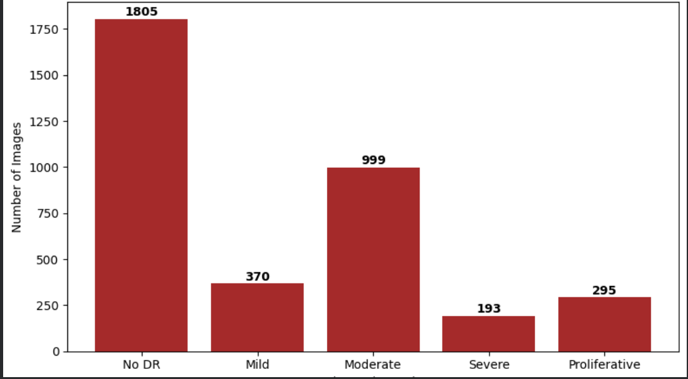
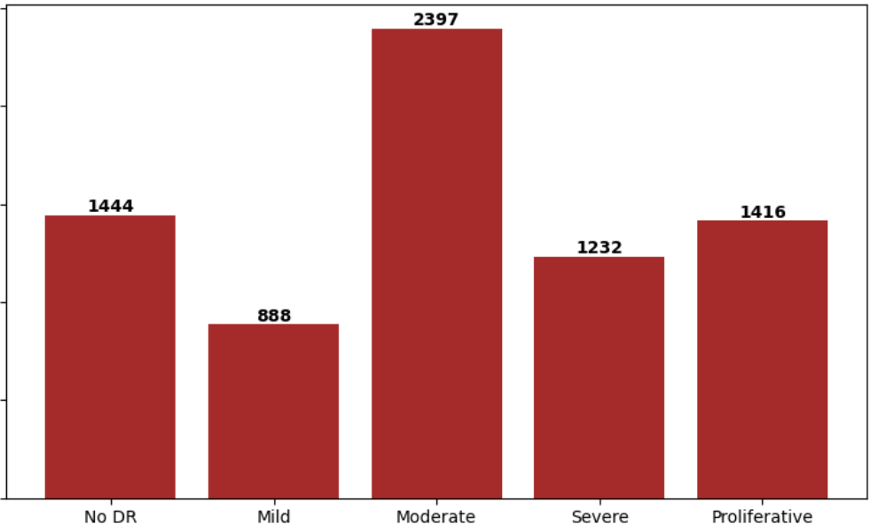
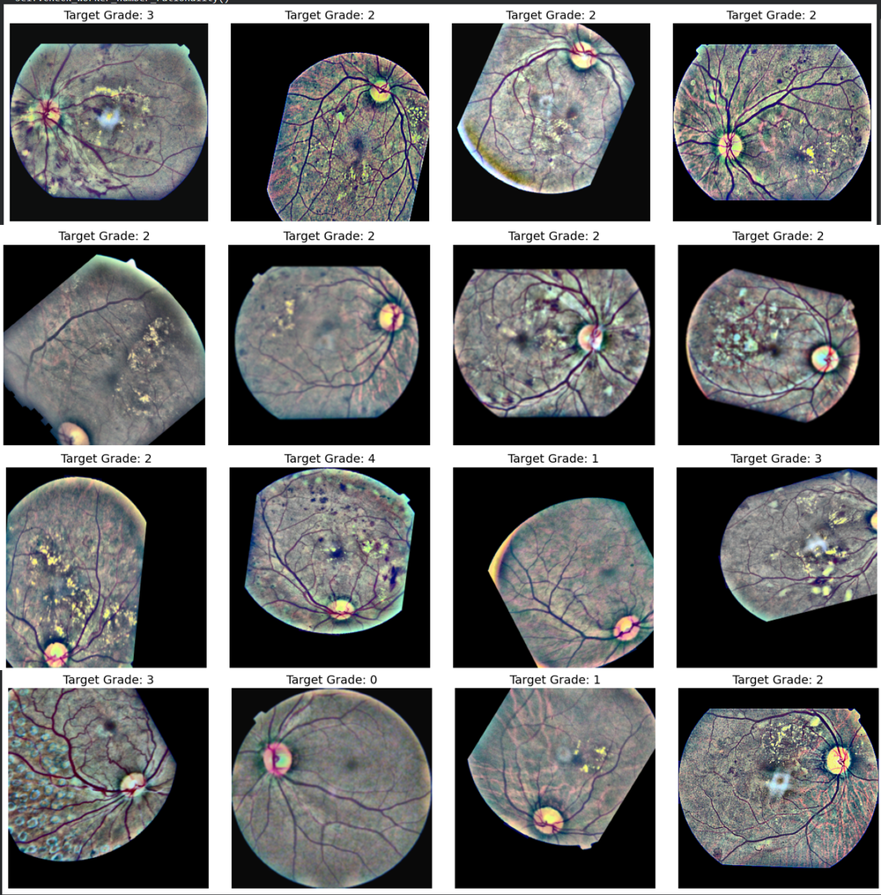
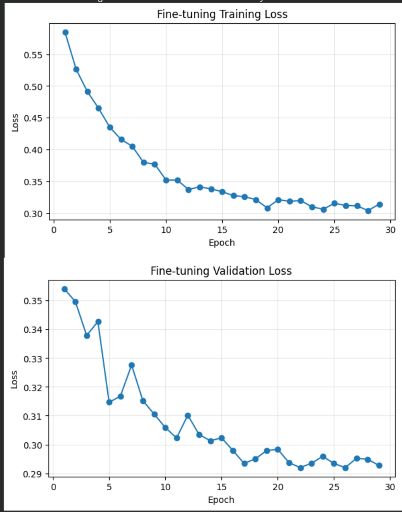
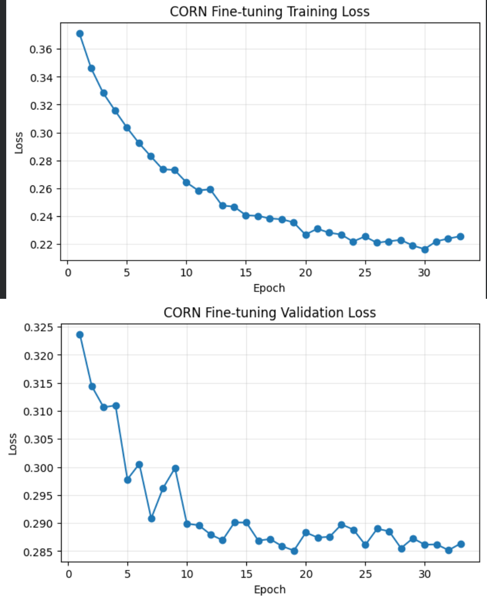
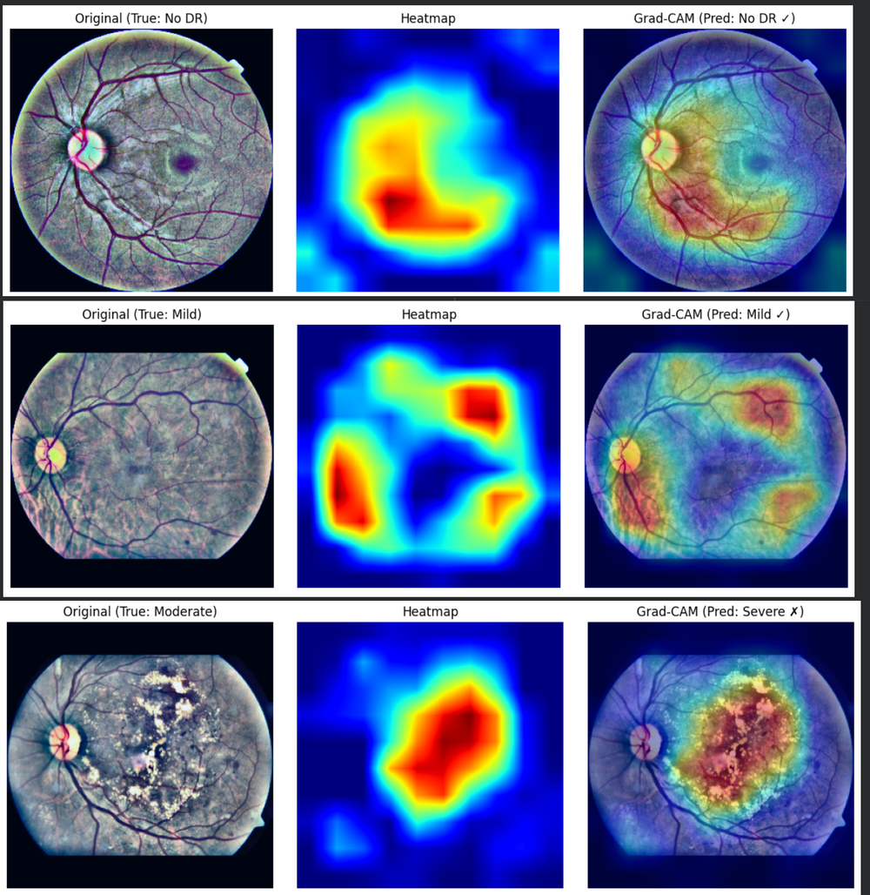

# RetinaGrade: Optimizing Diabetic Retinopathy Detection

**Authors:** Youssef Ashraf Mohamed (23010977) & Nour Eldeen Mohamed (23010920)

RetinaGrade is a deep learning pipeline developed to automatically grade Diabetic Retinopathy (DR) severity from fundus imagery using the APTOS 2019 dataset. The project evolves from a frozen EfficientNet-B3 baseline into a highly optimized architecture utilizing aggressive data augmentation, Generalized Mean (GeM) pooling, and Conditional Ordinal Regression for Neural Networks (CORN) to account for the progressive nature of the disease.

## Project Structure

The repository is organized into specific modules for data handling, model building, and training loops:

```text
├── Docs/
│   └── Retina_Grade_Final_Report.pdf     # Project reports and LaTeX documentation
├── Images/                               # Visual assets for documentation
├── ResultsBenchMark/
│   └── Retina Grader Results Tracker.pdf # Performance tracking and metrics
├── nootbooks/
│   └── model_training_and_eval.ipynb     # Jupyter notebooks for full pipeline execution
└── src/                                  # Core source code
    ├── EDA/
    │   ├── augumentation.py              # V1 and V2 Albumentations pipelines
    │   ├── augumented_set.py             # Dataset wrappers for oversampling
    │   ├── data_loading.py               # PyTorch DataLoaders
    │   └── utils.py                      # Exploratory data analysis helpers
    ├── eval/
    │   └── evaluation.py                 # Metric calculations (QWK, F1) and evaluation loops
    ├── models/
    │   ├── custom_layers.py              # Implementations of GeM pooling and custom heads
    │   ├── Loss.py                       # Focal loss and custom criterion definitions
    │   └── model_builder.py              # EfficientNet-B3 instantiation and layer unfreezing
    ├── preprocessing/
    │   ├── preprocessor.py               # Image cropping and normalization
    │   ├── preprocessor_without_g...     # Preprocessing variants (e.g., without Graham)
    │   └── quality_checker.py            # Image quality validation
    ├── training/
    │   ├── early_stopper.py              # Early stopping based on validation QWK/Loss
    │   ├── LR_Tune.py                    # Learning rate scheduling and tuning
    │   ├── trainer.py                    # Custom PyTorch training and validation loops
    │   └── WD_tune.py                    # Weight decay optimization experiments
    └── variants/
        ├── grad_cam.py                   # Interpretability and spatial activation heatmaps
        └── ploting_util.py               # Plotting utilities for loss curves and distributions
```

## Core Methodology

### 1. Preprocessing & Data Pipeline
*   **V2 Augmentation:** Utilizes `albumentations` for affine transformations, hue/saturation shifts, and dynamic blurring. Strips natural retinal hues to maximize the contrast of microaneurysms and exudates.
*   **Targeted Oversampling:** Addresses the heavy Grade 0 class imbalance by applying explicit multipliers to minority classes (e.g., Grade 3 multiplied by 5, Grade 4 by 3) via a deterministic array-tiling approach.

#### Dataset Distribution



#### V2 Augmentation Samples


### 2. Architecture Enhancements
*   **GeM Pooling:** Replaces standard Global Average Pooling to dynamically localize high-intensity disease markers. The operation is initialized at p=3 to act closer to max-pooling.
*   **Focal Loss:** Implemented (gamma = 2.0) prior to ordinal regression to force gradient updates on hard-to-classify edge cases rather than the Grade 0 majority.

### 3. Conditional Ordinal Regression (CORN)
*   Standard categorical cross-entropy fails to capture the progressive severity of DR (i.e., predicting Grade 4 as Grade 0 is a critical clinical error).
*   The CORN classification head outputs K-1 conditional binary probabilities, training the network to evaluate sequential thresholds ("Is the disease worse than Grade 0?", "Is it worse than Grade 1?").

### 4. Fine-Tuning Strategy
*   **Two-Stage Unfreezing:** The top three layers of the EfficientNet-B3 backbone (approx. 8.5 million parameters) are unfrozen to adapt to retinal domain specifics.
*   **Regularization:** Utilizes an Adam optimizer (1e-3) with increased weight decay (5e-4) on a 384x384 image resolution and a strict 80/20 data split to prevent overfitting.

## Benchmark Results

| Model Iteration | Validation QWK | F1 Score (Macro) | Image Resolution | Key Configurations |
| :--- | :--- | :--- | :--- | :--- |
| **Baseline (Frozen)** | 0.6500 | 0.4610 | 300x300 | GAP, Categorical Loss |
| **V1 Augmentation** | 0.5730 | 0.4400 | 300x300 | Focal Loss, Frozen |
| **Candidate GeM** | **0.8841** | **0.6919** | 300x300 | GeM (p=3), Unfrozen Top Layers |
| **Champion GeM** | 0.8774 | 0.6488 | 384x384 | GeM (p=3), Unfrozen, 5e-4 WD |
| **Final CORN Model** | **0.8831** | 0.6338 | 384x384 | CORN Head, Unfrozen, 5e-4 WD |

### Training Diagnostics

**GeM Model Convergence**


**CORN Model Convergence**


## Interpretability

Grad-CAM (Gradient-weighted Class Activation Mapping) is utilized to ensure the network relies on valid physiological markers rather than background artifacts.


## Requirements

*   Python 3.9+
*   PyTorch (with CUDA support recommended for training)
*   `torchvision`
*   `albumentations`
*   `timm` (for EfficientNet-B3 backbone)
*   `numpy`, `pandas`
*   `scikit-learn`
*   `matplotlib` / `seaborn` (for plotting utilities)
*   `opencv-python`
*   `jupyter` (to run the notebooks)

Install everything at once with:

```bash
pip install torch torchvision albumentations timm numpy pandas scikit-learn matplotlib seaborn opencv-python jupyter
```

> Tip: pin exact versions in a `requirements.txt` once your environment is finalized, then reinstall with `pip install -r requirements.txt` for reproducibility.

## Dataset Setup

1.  Download the **APTOS 2019 Blindness Detection** dataset (from Kaggle).
2.  Place the raw fundus images and the `train.csv` / `test.csv` label files into a local `data/` directory (create this folder at the project root).
3.  Update the dataset paths referenced in `src/EDA/data_loading.py` and `src/preprocessing/preprocessor.py` to point to your local `data/` directory.

## How to Run

### Option A — Run the full pipeline via notebook (recommended)

```bash
# 1. Clone the repository
git clone <repository-url>
cd RetinaGrade

# 2. Create and activate a virtual environment
python -m venv venv
source venv/bin/activate        # On Windows: venv\Scripts\activate

# 3. Install dependencies
pip install torch torchvision albumentations timm numpy pandas scikit-learn matplotlib seaborn opencv-python jupyter

# 4. Launch Jupyter and open the training notebook
jupyter notebook nootbooks/model_training_and_eval.ipynb
```

Run the notebook cells sequentially — it walks through preprocessing, augmentation, model building, training, and evaluation end to end.

### Option B — Run individual pipeline stages from source

```bash
# Preprocess and validate raw images
python -m src.preprocessing.preprocessor
python -m src.preprocessing.quality_checker

# Build the model (EfficientNet-B3 backbone + GeM pooling / CORN head)
python -m src.models.model_builder

# Train the model
python -m src.training.trainer

# Evaluate against the validation set (QWK, F1)
python -m src.eval.evaluation

# Generate Grad-CAM interpretability visualizations
python -m src.variants.grad_cam
```

> Note: module paths above assume `src/` contains `__init__.py` files so it can be run with Python's `-m` flag. If it doesn't, run the scripts directly instead, e.g. `python src/training/trainer.py`, adjusting relative imports as needed.

### Configuring Training Runs

Key hyperparameters (learning rate, weight decay, image resolution, unfreezing depth) are set in `src/training/trainer.py`, `src/training/LR_Tune.py`, and `src/training/WD_tune.py`. To reproduce the **Champion GeM** or **Final CORN** results from the benchmark table, use:

*   Image resolution: `384x384`
*   Optimizer: Adam, learning rate `1e-3`
*   Weight decay: `5e-4`
*   Backbone: EfficientNet-B3 with the top 3 layers unfrozen
*   Pooling: GeM (`p=3`) — and for the CORN variant, swap the classification head to the CORN head in `src/models/custom_layers.py`

## Evaluation Metrics

Model performance is tracked primarily via:
*   **QWK (Quadratic Weighted Kappa)** — the primary competition metric, penalizing predictions further from the true grade more heavily.
*   **F1 Score (Macro)** — ensures balanced performance across all five DR severity grades, not just the majority class.

See `src/eval/evaluation.py` for the metric implementations and `ResultsBenchMark/Retina Grader Results Tracker.pdf` for full experiment logs.

## Documentation

*   Full project write-up: `Docs/Retina_Grade_Final_Report.pdf`
*   Results tracking: `ResultsBenchMark/Retina Grader Results Tracker.pdf`